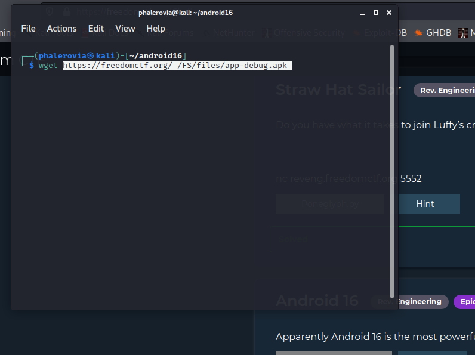
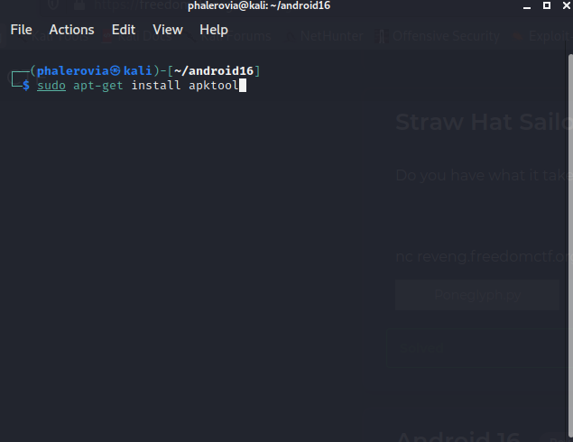
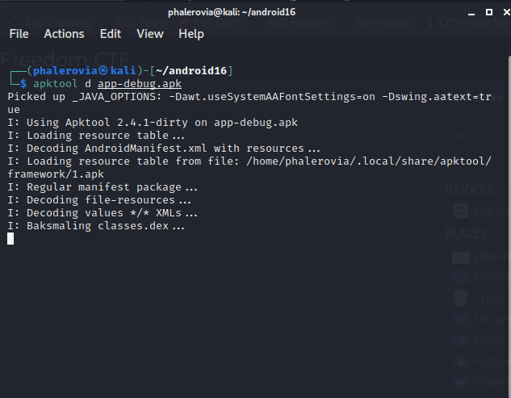
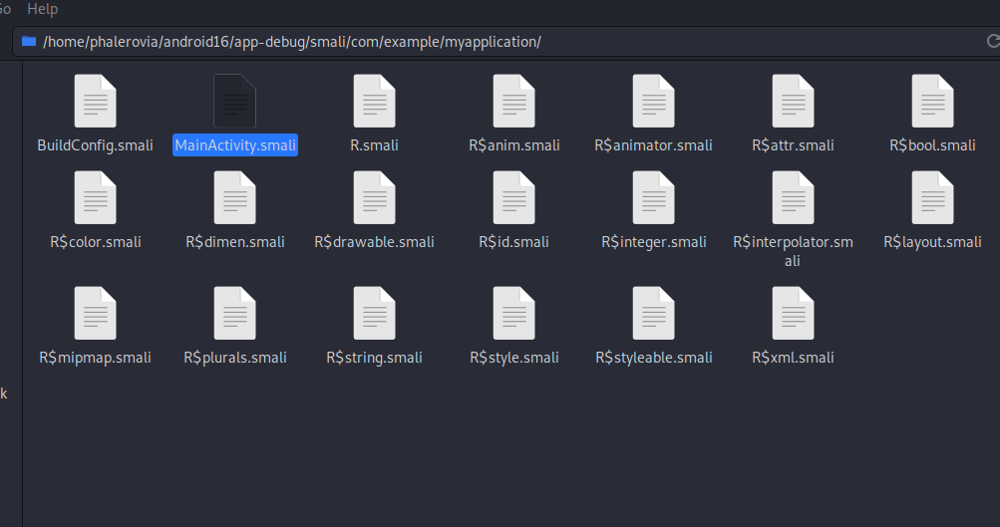
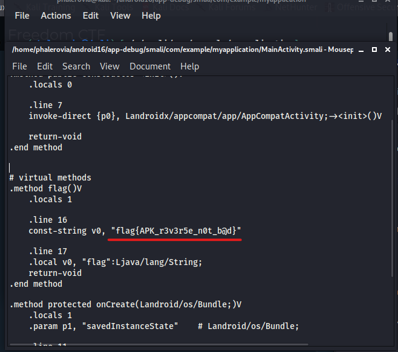

# Android 16

First I started by downloading the file



Next I dowloaded the apktool

```
sudo apt install apktool -y
```



After Installing that, I used this command to decode the file

```
apktool d app-debug.apk
```





Then in 
```
/app-debug/smali/com/example/myapplication/MainActivity.smali
```
We can find the flag

