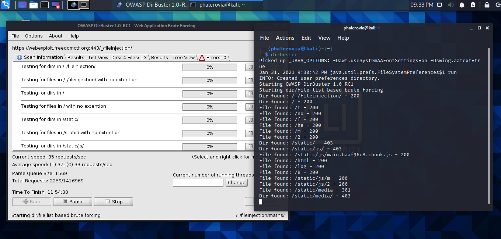
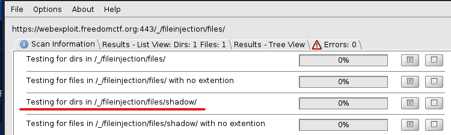
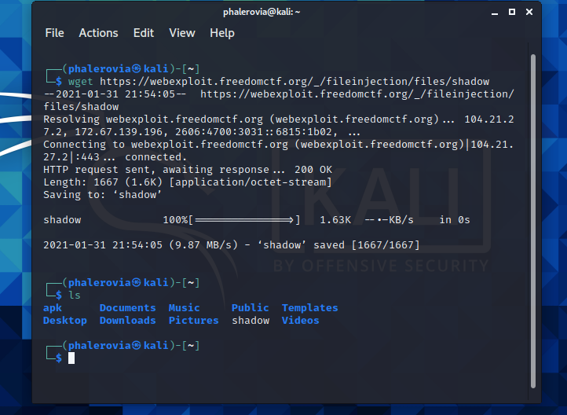
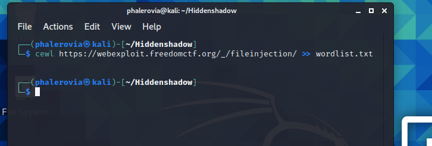
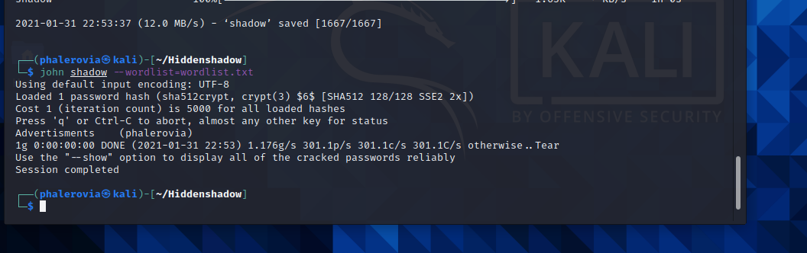

# Hidden Shadow 
For this I used 3 tools:

* Dirbuster
* Cewl
* John The Ripper

## Dirbuster

I used dirbuster to find hidden files, and direcotires.

Once I found the path to shadow file, I downloaded it. 

## Cewl 

I used Cewl to crunch out a word list from the site.

## John The Ripper

Next I loaded shadow file in John and used the wordlist that I created. 

And got the password.