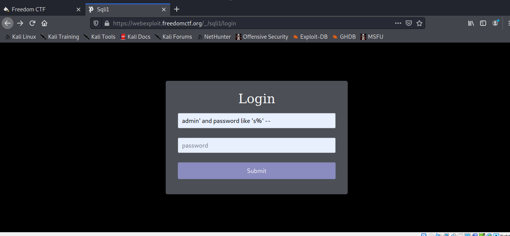

# Sloppy Admin

As this is an Injection and we have to find the password. I used the
```
admin' and password like 'a%' --
```



After that if the login is sucessfully I can know that the first letter of the password is a, if it doesn't sucessfully login then I can tell that is't the wrong letter. 

I keept on doing that to get the password `sPMoodmH0CNMHhsxnsGv`